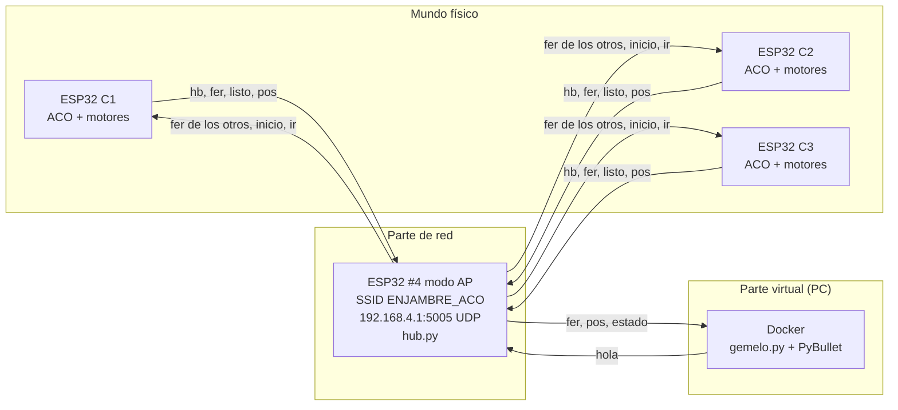
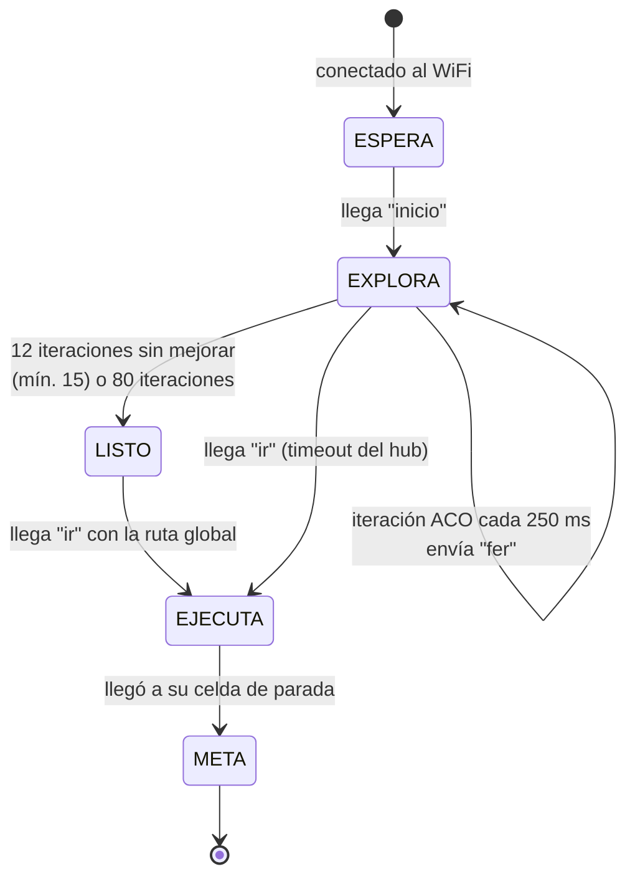
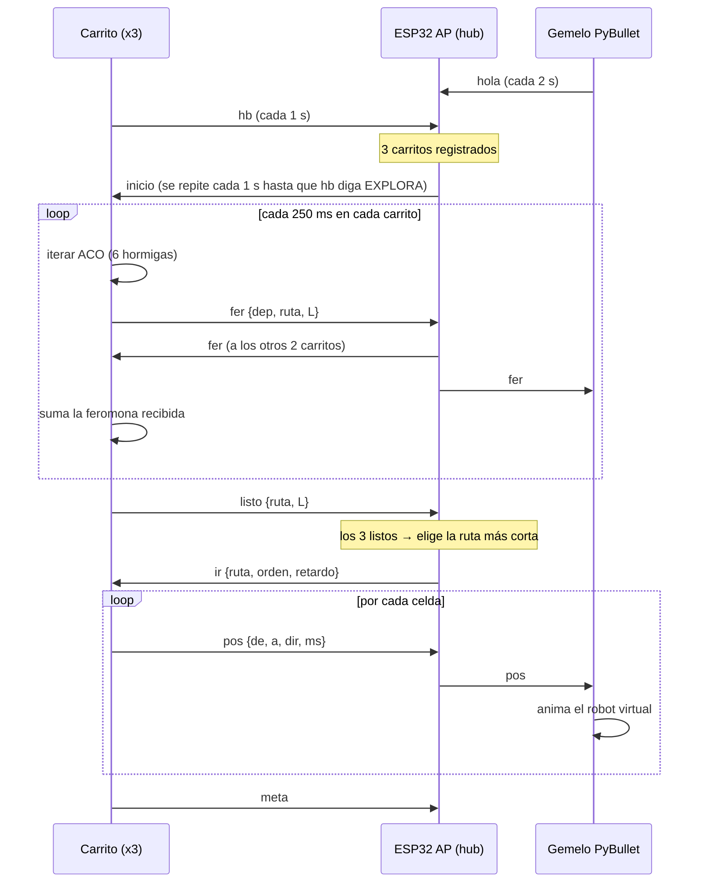

# Enjambre de 3 carritos con ACO en ESP32 + gemelo digital en PyBullet

Tres carritos con ESP32 tienen que encontrar la ruta más corta entre el punto **A** y la **meta** de un laberinto (o almacén). Cada ESP32 corre su propio **algoritmo de colonia de hormigas (ACO)**. Las ESP32 se pasan la feromona por WiFi a través de una cuarta ESP32 en **modo AP**, y una simulación en **PyBullet** dentro de **Docker** muestra lo mismo con 3 robots virtuales.


*Simulación web del sistema (`simulacion/enjambre_aco.html`) a 2×: los carritos se conectan, exploran con hormigas, comparten feromona por la red y recorren la ruta óptima.*

---

## Contenido

1. [Resumen rápido](#1-resumen-rápido)
2. [La simulación paso a paso](#2-la-simulación-paso-a-paso)
3. [Arquitectura](#3-arquitectura)
4. [Funcionamiento detallado](#4-funcionamiento-detallado)
5. [El algoritmo de colonia de hormigas](#5-el-algoritmo-de-colonia-de-hormigas-aco)
6. [Protocolo de red](#6-protocolo-de-red)
7. [Estructura de archivos](#7-estructura-de-archivos)
8. [Puesta en marcha](#8-puesta-en-marcha)
9. [Posibles errores y cómo solucionarlos](#9-posibles-errores-y-cómo-solucionarlos)
10. [Limitaciones](#10-limitaciones)
11. [Mejoras propuestas](#11-mejoras-propuestas)
12. [Pruebas realizadas](#12-pruebas-realizadas)

---

## 1. Resumen rápido

| Parte | Hardware / software | Qué hace |
|---|---|---|
| **Mundo físico** | 3 × ESP32 + puente H L298N + 2 motores DC (MicroPython) | Cada carrito ejecuta ACO localmente, publica su feromona y al final recorre la ruta |
| **Parte de red** | 1 × ESP32 en modo AP (MicroPython) | Crea el WiFi `ENJAMBRE_ACO`, reenvía la feromona entre carritos, elige la mejor ruta y da la orden de salida |
| **Parte virtual** | PC con Docker + PyBullet (Python) | Gemelo digital: laberinto en 3D, feromona en el piso y 3 robots que copian el movimiento real |

El ciclo completo es **ESPERA → EXPLORA → EJECUTA → META**:

1. Los 3 carritos se conectan al AP y se registran.
2. Cada uno lanza hormigas virtuales en su ESP32. La feromona que deja cada carrito llega a los otros dos (y al gemelo) por la red, así que las 3 colonias aprenden juntas.
3. Cuando cada carrito deja de mejorar su ruta, avisa al AP con un mensaje `listo`.
4. Cuando los 3 están listos, el AP envía la mejor ruta global y los carritos salen uno tras otro, separados 3 s.
5. El gemelo en PyBullet replica todo en tiempo real.

---

## 2. La simulación paso a paso

La simulación web (`simulacion/enjambre_aco.html`) usa la **misma lógica** de `aco.py`, `hub.py` y `carrito.py`, escrita en JavaScript. Sirve para entender el sistema y para probar parámetros antes de montar el hardware. Se abre con doble clic en cualquier navegador; no hace falta instalar nada.

### Paneles

| Panel | Qué representa |
|---|---|
| **Parte virtual** (izquierda) | Vista superior del gemelo: paredes, feromona en cada pasillo (de gris a naranja y a rojo) y hormigas (puntos de color). Los carritos se muestran como rectángulos con número. |
| Pestañas *Gemelo / Tabla local C1–C3* | Cambian entre la feromona que ve el gemelo y la tabla interna de cada ESP32. Sirve para comprobar que las 3 tablas se parecen gracias al intercambio. |
| **Parte de red** | Paquetes UDP viajando entre los carritos, el AP y el PC. Naranja = `fer`, morado = `inicio`/`ir`, gris = `pos`. Una ✕ roja es un paquete perdido. |
| **Mundo físico** | Estado de cada ESP32: fase, iteración, mejor longitud y cuántos paquetes de feromona le han llegado. |
| **Convergencia** | Longitud promedio de las rutas de las hormigas en cada iteración, junto a la línea del óptimo (calculado con BFS). |
| **Monitor serie** | Lo que imprimirían las 4 ESP32 y el gemelo por el puerto serie. |

### Controles

| Control | Efecto |
|---|---|
| α (alfa) | Peso de la feromona. Si es alto, las hormigas siguen más lo que ya se aprendió. |
| β (beta) | Peso de la heurística (cercanía a la meta). Si es alto, las hormigas son más "codiciosas". |
| ρ (rho) | Evaporación por iteración. Si es alta, la colonia olvida rápido y explora más. |
| Hormigas/ESP32 | Hormigas que lanza cada carrito por iteración. |
| Pérdida UDP | Porcentaje de paquetes que se pierden en el WiFi, para ver cómo se comporta el sistema con mala señal. |
| Mapa | El laberinto del proyecto (9×9) o un almacén aleatorio de 13×13 (botón **Otro** para generar uno nuevo). |

### Fase 1 · ESPERA: conexión al AP


El AP está activo y los carritos se van conectando. Cada uno envía un latido (`hb`) cada segundo hasta que el AP lo registra. El gemelo envía `hola` para que el AP sepa a quién reenviarle los datos. Cuando hay **3 carritos registrados**, el AP cambia a EXPLORA.

### Fase 2 · EXPLORA: hormigas y feromona compartida


Cada ESP32 lanza 6 hormigas cada 250 ms. Los puntos de colores son la mejor hormiga de la iteración de cada carrito recorriendo el laberinto. Los pasillos que más se usan se ponen rojos. En el panel de red se ve cómo cada paquete `fer` sube al AP y baja a los otros dos carritos y al PC. La ✕ marca un paquete perdido.


A la derecha está la **tabla local de feromona del carrito 1** en el mismo momento. No es idéntica a la del gemelo porque cada ESP32 evapora a su propio ritmo y algunos paquetes se pierden, pero los pasillos importantes coinciden. Ese parecido es la evidencia de que el intercambio por red funciona.

<br clear="right">

### Fase 3 · EJECUTA: recorrido de la ruta óptima


Los 3 carritos dejaron de mejorar y enviaron `listo`. El AP envía `ir` con la mejor ruta global (línea punteada) y el orden de salida. El carrito 1 sale de inmediato, el 2 a los 3 s y el 3 a los 6 s. En cada giro y en cada celda el carrito envía `pos` y el gemelo lo replica.

### Fase 4 · META: fila india en la meta


Para que no choquen, el carrito 1 llega a la meta, el 2 se detiene una celda antes y el 3 dos celdas antes.

### Convergencia y monitor serie


- La línea punteada es el **óptimo real** (20 celdas), calculado con una búsqueda en anchura (BFS).
- Las curvas son el **promedio** de longitud de las hormigas de cada carrito. Bajan y oscilan cerca del óptimo: las hormigas siguen explorando un poco, que es lo esperado en ACO.
- *Mejor global* = 20 confirma que el enjambre encontró la ruta más corta.

### Escenario con 40 % de pérdida UDP


Con mala señal se pierden muchos paquetes `fer` (✕ rojas) y cada carrito recibe menos feromona de los demás. El sistema sigue funcionando porque:

- `inicio`, `ir` y `listo` se **reenvían cada segundo** hasta que se confirman.
- Si se pierde un paquete `fer`, solo se pierde información. Cada carrito sigue con su colonia local y converge un poco más lento.

Aquí el carrito 3 aún está en la iteración 0: el primer `inicio` se perdió y le llegó en el reintento.

### Almacén aleatorio 13×13


Con más caminos alternativos la feromona tarda más en concentrarse, y se ve mejor cómo trabaja el algoritmo.

> **Nota:** las imágenes son de la simulación web. El gemelo en PyBullet muestra lo mismo en 3D: piso con baldosas de feromona, paredes azul oscuro, bandera a cuadros en la meta, esferas como hormigas y 3 carritos de colores. Al ejecutarlo con `--grabar`, genera su propio GIF en `salida/`.

---

## 3. Arquitectura



**¿Por qué una cuarta ESP32 como AP y no un router?** Porque así lo pide la guía y porque hace que el sistema sea autónomo: no depende del WiFi de la universidad, la IP del hub siempre es `192.168.4.1` y el AP también hace de *broker* de feromonas.

**¿Por qué UDP y no TCP o MQTT?** UDP es liviano en MicroPython, no necesita mantener conexiones abiertas, y perder un paquete de feromona no daña el algoritmo. Los mensajes críticos se reintentan desde la aplicación.

### Hardware por carrito

| Componente | Cantidad | Nota |
|---|---|---|
| ESP32 DevKit (38 pines) | 1 | MicroPython ≥ 1.20 |
| Puente H L298N (o TB6612FNG) | 1 | Quitar los jumpers de ENA/ENB para controlar con PWM |
| Motorreductores TT 3–6 V + ruedas | 2 | Tracción diferencial, más una rueda loca |
| Batería 2S Li-ion (7.4 V) | 1 | Para los motores; la ESP32 se alimenta por el regulador 5 V del L298N o por un regulador aparte |
| Condensador 470–1000 µF | 1 | En la entrada de 5 V de la ESP32, para evitar reinicios (*brownout*) |

---

## 4. Funcionamiento detallado

### Máquina de estados del carrito (`carrito.py`)



### Secuencia de mensajes



### Lo que hace cada programa en cada fase

| Fase | Carrito (`carrito.py`) | AP (`hub.py`) | Gemelo (`gemelo.py`) |
|---|---|---|---|
| ESPERA | Conecta al WiFi y envía `hb` cada segundo | Registra la IP y el puerto de cada carrito; LED parpadea lento | Envía `hola`, dibuja el laberinto y los carritos en A |
| EXPLORA | Ejecuta ACO, envía su feromona y aplica la que recibe | Reenvía cada `fer` a los demás y guarda la mejor ruta; LED rápido | Evapora y suma la feromona, colorea el piso y anima las hormigas |
| LISTO | Envía `listo` con su mejor ruta | Espera a que los 3 estén listos (o 60 s de timeout) | Muestra el estado en el HUD |
| EJECUTA | Gira y avanza celda por celda, enviando `pos` en cada movimiento | Envía `ir` y reenvía `pos` al gemelo; LED fijo | Interpola el movimiento del robot virtual con la duración que dice `pos` |
| META | Para los motores y envía `meta` | Marca el carrito como META | Al llegar los 3, guarda el GIF (si se pidió) |

### Movimiento físico

El carrito usa **navegación por celdas en lazo abierto**. Conoce su rumbo (N, E, S, O) y para cada paso de la ruta:

1. Calcula la dirección de la celda siguiente.
2. Calcula el giro: `(dir_nueva − rumbo) mod 4` → 0 = recto, 1 = derecha, 2 = media vuelta, 3 = izquierda.
3. Gira durante `T_GIRO90_MS × cuartos` y luego avanza durante `T_CELDA_MS`.
4. Arranca con una rampa de PWM (5 escalones de 20 ms) para que las ruedas no patinen, y frena 80 ms entre movimientos.

---

## 5. El algoritmo de colonia de hormigas (ACO)

### Idea

Las hormigas reales dejan feromona en el camino. Los caminos cortos se recorren más veces por unidad de tiempo, acumulan más feromona y atraen a más hormigas. La feromona se **evapora**, así que los caminos malos se olvidan.

### El laberinto como grafo

- Cada celda libre de `MAPA` es un **nodo**, y cada par de celdas vecinas forma una **arista**.
- La feromona τ se guarda **por arista y es simétrica**: ir de i a j y de j a i es la misma arista. Por eso cada arista tiene un id canónico, calculado con `arista(i, d)` en `laberinto.py`.
- El laberinto del proyecto tiene 52 celdas libres y 54 aristas. El óptimo es de **20 pasos**, y hay **dos rutas distintas** con esa longitud.

### Regla de decisión de cada hormiga

Desde la celda *i*, la probabilidad de ir a una vecina *j* no visitada es:

$$
p_{ij} = \frac{\tau_{ij}^{\,\alpha}\;\eta_j^{\,\beta}}{\sum_{k \in \text{vecinos libres}} \tau_{ik}^{\,\alpha}\;\eta_k^{\,\beta}}
\qquad
\eta_j = \frac{1}{\text{distancia Manhattan}(j,\ \text{meta}) + 1}
$$

**Hormiga con retroceso:** si la hormiga llega a un callejón sin salida, se devuelve (saca la celda de la pila) y prueba otra opción. Así **siempre** encuentra la meta y la ruta final **no tiene ciclos**, porque la pila nunca repite celdas.

### Actualización de la feromona (en cada iteración)

$$
\tau_{ij} \leftarrow \max\!\Big(\tau_{\min},\ (1-\rho)\,\tau_{ij}\Big) \;+\; \sum_{\text{hormigas}} \frac{Q}{L_k} \;+\; e\,\frac{Q}{L^{*}}
\qquad \tau \in [0.05,\ 10]
$$

- $\rho$: evaporación (0.15).
- $Q/L_k$: cada hormiga deposita más feromona cuanto más corta es su ruta ($Q = 1$).
- $e\,Q/L^{*}$: **refuerzo elitista** ($e = 2$) sobre la mejor ruta encontrada hasta ahora.
- Los límites $[\tau_{\min}, \tau_{\max}]$ (al estilo MAX-MIN) evitan que una arista se vuelva 0, lo que impediría explorarla, o que crezca sin control.

### La parte distribuida (lo que hace especial a este proyecto)

Cada ESP32 tiene **su propia tabla τ**. En cada iteración el carrito:

1. Calcula sus depósitos `Δτ` (un diccionario `{arista: delta}`).
2. Los aplica a su tabla y **envía solo esos deltas** en un mensaje `fer`, para que el paquete sea pequeño (~1 KB).
3. Cuando le llega un `fer` de otro carrito, **suma esos deltas** a su propia tabla (`aco.aplicar(dep)`).
4. Si la ruta recibida es mejor que la suya, la adopta como élite (`considerar_ruta`).

En la práctica es una colonia de 18 hormigas por iteración repartida en 3 procesadores, coordinada por **estigmergia digital**: los carritos no se dan órdenes, solo modifican el "ambiente" (la feromona) que todos leen.

### Criterio de parada

Un carrito pasa a LISTO cuando lleva **al menos 15 iteraciones** y su mejor ruta **no mejoró en 12 iteraciones seguidas**, o cuando llega a 80 iteraciones.

### Parámetros y su efecto

| Parámetro | Valor | Si lo subes | Si lo bajas |
|---|---|---|---|
| `alfa` | 1.0 | Converge más rápido, pero puede quedarse en una ruta subóptima | Explora más y converge más lento |
| `beta` | 2.0 | Más "codicioso" hacia la meta; puede fallar en laberintos con trampas | Depende más de la feromona |
| `rho` | 0.15 | Olvida rápido; más exploración e inestabilidad | Memoria larga; puede estancarse |
| `q` | 1.0 | Satura τ_max más rápido; todo se ve "rojo" | Aprende más lento |
| `n_hormigas` | 6 | Mejor exploración, pero más CPU por iteración en la ESP32 | Más ruido |
| `elitismo` | 2.0 | Refuerza mucho la mejor ruta; converge rápido | Converge más lento |
| `PERIODO_IT_MS` | 250 | Menos tráfico de red | Más tráfico y menos tiempo libre de CPU |

---

## 6. Protocolo de red

Todos los mensajes son **JSON por UDP**, puerto **5005** del AP (`192.168.4.1`).

| Mensaje | De → a | Ejemplo | ¿Se reintenta? |
|---|---|---|---|
| `hb` | carrito → hub | `{"t":"hb","id":1,"est":"EXPLORA","it":12,"L":20}` | Es periódico (1 s) |
| `fer` | carrito → hub → otros + gemelo | `{"t":"fer","id":1,"it":12,"dep":[[49,0.15],...],"ruta":[12,13,...],"L":20}` | No (perderlo no es grave) |
| `listo` | carrito → hub | `{"t":"listo","id":1,"ruta":[...],"L":20}` | Sí: el hub lo confirma con el `hb` siguiente |
| `inicio` | hub → carritos | `{"t":"inicio"}` | Sí, cada 1 s mientras el carrito siga en ESPERA |
| `ir` | hub → carritos | `{"t":"ir","ruta":[...],"L":20,"orden":[1,2,3],"retardo_ms":3000}` | Sí, cada 1 s mientras el carrito siga en LISTO |
| `pos` | carrito → hub → gemelo | `{"t":"pos","id":2,"de":12,"a":13,"dir":1,"ms":900}` | No |
| `meta` | carrito → hub → gemelo | `{"t":"meta","id":2,"celda":86}` | Es periódico vía `hb` |
| `hola` | gemelo → hub | `{"t":"hola","id":"G"}` o con `"cmd":"inicio"` | Es periódico (2 s) |
| `estado` | hub → gemelo | `{"t":"estado","fase":"EXPLORA","carritos":{...},"L":20}` | Es periódico (1 s) |

Las celdas se numeran como `fila × COLS + columna`; en el mapa de 11 columnas, A = 12 y la meta = 108.

---

## 7. Estructura de archivos

```
enjambre_aco/
├── esp32_comun/          → copiar a LAS 4 ESP32 (y lo usa el PC)
│   ├── laberinto.py      mapa, vecinos, heurística, ids de aristas
│   ├── aco.py            clase ColoniaACO
│   └── protocolo.py      SSID, puertos, JSON, ticks compatibles PC/ESP32
├── esp32_ap/             → ESP32 #4
│   ├── main.py           crea el AP, socket UDP, LED de estado, botón BOOT
│   └── hub.py            clase Hub (registro, difusión, fases)
├── esp32_carrito/        → ESP32 C1, C2, C3
│   ├── config.py         ← lo ÚNICO que cambia entre carritos (ID, pines, calibración)
│   ├── main.py           conecta al AP y arranca el carrito
│   ├── carrito.py        máquina de estados
│   └── motores.py        L298N con PWM, avanzar celda y girar
├── gemelo_pybullet/
│   ├── gemelo.py         gemelo digital PyBullet (GUI o DIRECT + GIF)
│   ├── simulador_esp32.py  emula AP + carritos en el PC con el MISMO código
│   ├── requirements.txt
│   └── Dockerfile
├── simulacion/enjambre_aco.html   simulación interactiva en el navegador
├── docs/img/             capturas de este README
├── salida/               aquí quedan los GIF del gemelo
└── docker-compose.yml
```

---

## 8. Puesta en marcha

### 8.1 Cargar MicroPython y los archivos

1. Flashea MicroPython ≥ 1.20 en las 4 ESP32:
   `esptool.py --chip esp32 erase_flash` y luego `esptool.py --chip esp32 write_flash -z 0x1000 ESP32_GENERIC-xxxx.bin`.
2. Copia los archivos con `mpremote` (o con Pymakr en VS Code, o con Thonny):

```bash
# ESP32 #4 — punto de acceso
mpremote connect COM5 cp esp32_comun/laberinto.py esp32_comun/aco.py esp32_comun/protocolo.py : \
  + cp esp32_ap/hub.py esp32_ap/main.py :

# Carrito 1 (repetir con ID_CARRITO = 2 y 3 en config.py)
mpremote connect COM6 cp esp32_comun/laberinto.py esp32_comun/aco.py esp32_comun/protocolo.py : \
  + cp esp32_carrito/config.py esp32_carrito/carrito.py esp32_carrito/motores.py esp32_carrito/main.py :
```

3. **Orden de encendido:** primero el AP (LED parpadeando lento), luego los carritos. Para ver qué pasa, abre el monitor serie de cualquiera con `mpremote connect COM6 repl`.

### 8.2 Cableado (valores por defecto de `config.py`)

| L298N | ESP32 | | L298N | ESP32 |
|---|---|---|---|---|
| IN1 | GPIO26 | | IN3 | GPIO25 |
| IN2 | GPIO27 | | IN4 | GPIO33 |
| ENA (sin jumper) | GPIO14 | | ENB (sin jumper) | GPIO32 |
| GND | GND **común** con la batería | | +12V | batería 7.4 V |

### 8.3 Calibración (cada carrito por separado)

1. Pon `ID_CARRITO`, `RUMBO_INICIAL` (hacia dónde mira el carrito en A) y los pines.
2. Desde el REPL, mide el avance:
   ```python
   from motores import Motores; import config as c
   m = Motores(c.PIN_IN1,c.PIN_IN2,c.PIN_IN3,c.PIN_IN4,c.PIN_ENA,c.PIN_ENB, vel=c.VELOCIDAD, t_celda_ms=900, t_giro90_ms=420)
   m.avanzar_celda()   # ¿avanzó exactamente 30 cm? ajusta t_celda_ms
   m.girar(1)          # ¿giró 90°? ajusta t_giro90_ms
   m.girar(-1)
   ```
3. Si se desvía en recta, baja la corrección del motor más rápido (`CORR_IZQ` o `CORR_DER`, por ejemplo 0.93).
4. Calibra **con la batería cargada y en el piso real**, porque los tiempos cambian con el voltaje y el agarre.

### 8.4 Gemelo digital

**Demo sin hardware:**
```bash
docker compose up --build gemelo-sim          # graba salida/gemelo_sim.gif
# o sin Docker:
pip install -r gemelo_pybullet/requirements.txt
python gemelo_pybullet/gemelo.py --sim        # ventana 3D
```

**Con las ESP32 reales:**
1. **Construye la imagen de Docker antes** de conectarte al AP, porque el AP no tiene internet: `docker compose build`.
2. Conecta el PC al WiFi `ENJAMBRE_ACO` (clave `hormigas123`).
3. Ejecuta `docker compose up gemelo` (graba `salida/gemelo_real.gif`) o `python gemelo_pybullet/gemelo.py --hub-ip 192.168.4.1` para ver la ventana 3D.

| Opción de `gemelo.py` | Variable de entorno | Uso |
|---|---|---|
| `--sim` | `SIM=1` | Emula el AP y los 3 carritos en el PC |
| `--hub-ip` | `HUB_IP` | IP del AP (por defecto `192.168.4.1`) |
| `--modo gui/direct` | `MODO` | Ventana 3D o sin ventana (Docker) |
| `--grabar ruta.gif` | `GRABAR` | Graba un GIF |
| `--salir-al-terminar` | `SALIR_AL_TERMINAR=1` | Cierra cuando los 3 llegan |
| Teclas `i` / `q` | — | Forzar el inicio / salir |

**Modo híbrido** (1 carrito real + 2 emulados), muy útil cuando solo hay un carrito armado:
`python gemelo_pybullet/simulador_esp32.py --sin-hub --hub-ip 192.168.4.1 --carritos 2,3`

---

## 9. Posibles errores y cómo solucionarlos

### WiFi y red

| Síntoma | Causa probable | Solución |
|---|---|---|
| El carrito parpadea el LED y nunca se conecta | SSID o clave distintos; el AP está apagado | Revisa `SSID`/`CLAVE` en `protocolo.py` (igual en las 4 ESP32) y enciende primero el AP |
| `OSError: [Errno 12] ENOMEM` al crear el socket | Poca RAM libre | Ejecuta `gc.collect()`, reduce `n_hormigas` o compila los `.py` a `.mpy` con `mpy-cross` |
| El AP no cambia a EXPLORA | Falta un carrito por registrar o hay dos con el mismo `ID_CARRITO` | Mira el monitor serie del AP (`carrito X registrado`); cada carrito debe tener un ID distinto |
| Un carrito se queda en ESPERA mientras los otros exploran | Se perdió el `inicio` o la señal es débil | Se resuelve solo con el reintento de 1 s; si no, acerca el carrito al AP |
| `ap.config()` lanza error | Versión vieja de MicroPython (usa `essid`/`password`) | El código ya prueba ambas formas; si falla, actualiza a la versión ≥ 1.20 |
| La feromona converge muy lento | Pérdida alta de paquetes `fer` | Acerca el AP al centro del laberinto y evita obstáculos metálicos; baja la potencia de los motores (generan ruido) |

### Gemelo y Docker

| Síntoma | Causa probable | Solución |
|---|---|---|
| El gemelo no recibe nada (`mensajes recibidos: 0`) | El PC no está en `ENJAMBRE_ACO`, o el firewall de Windows bloquea UDP | Conéctate al AP y permite Python/Docker en el firewall (red privada) |
| `pip install pybullet` falla en Windows | No hay *wheel* para tu versión de Python y falta el compilador de C++ | Usa Python 3.10/3.11 o `conda install -c conda-forge pybullet`, o usa Docker |
| `cannot connect to X server` | Pediste el modo GUI dentro de Docker | Usa `MODO=direct` y revisa el GIF, o corre `gemelo.py` fuera de Docker |
| `docker compose build` no descarga nada | El PC está conectado al AP, que no tiene internet | Construye la imagen antes, con internet |
| `Address already in use` (5005/5010) | Otro gemelo o simulador sigue abierto | Ciérralo o cambia `--puerto-local` |
| Los robots virtuales van "a saltos" | Llegan paquetes `pos` en ráfaga | Es normal con WiFi lento; el gemelo acelera la animación cuando se atrasa |

### Mecánica y electrónica

| Síntoma | Causa probable | Solución |
|---|---|---|
| La ESP32 se reinicia al arrancar los motores (`Brownout detector was triggered`) | Caída de voltaje por el pico de corriente de los motores | Condensador de 470–1000 µF en 5 V, regulador independiente para la ESP32, GND común |
| El carrito gira de más o de menos y se acumula el error | Navegación en lazo abierto, batería bajando o piso resbaloso | Recalibra `T_GIRO90_MS`, usa velocidad constante o añade encoders o MPU6050 (ver mejoras) |
| Se va hacia un lado en recta | Los motores no son idénticos | Ajusta `CORR_IZQ` / `CORR_DER` |
| Un motor no gira | Se dejó el jumper de ENA/ENB o el cableado está mal | Quita el jumper y revisa la tabla de pines |
| Comportamiento raro en el arranque | Pines de arranque (0, 2, 12, 15) usados para motores | No los uses; los pines por defecto (25, 26, 27, 32, 33, 14) son seguros como salida |
| Los carritos chocan en la meta | Tiempos distintos entre carritos | Aumenta `retardo_salida_ms` en `Hub(...)` (por defecto 3000 ms) |

### Algoritmo

| Síntoma | Causa probable | Solución |
|---|---|---|
| Todo el laberinto se ve "rojo" en el gemelo | `q` demasiado alto: la feromona se satura en τ_max | Usa `q = 1` (valor actual) o sube `tau_max` |
| Se queda con una ruta más larga | `alfa` o `elitismo` muy altos, o `rho` muy bajo (estancamiento) | Baja `alfa` a 0.5–1, sube `rho` a 0.2–0.3 |
| Converge "demasiado rápido" y no se nota el aprendizaje | El laberinto es pequeño y β = 2 ya guía muy bien | Usa un mapa más grande o baja `beta` a 0.5–1 para la demostración |
| `ValueError: No se encontró 'A'` | Falta A o M en `MAPA` | Revisa el mapa; todas las filas deben tener la misma longitud |
| Los carritos usan mapas distintos | `laberinto.py` no se copió igual a todas | Copia el mismo archivo a las 4 ESP32 y al PC |

---

## 10. Limitaciones

1. **Navegación en lazo abierto.** El carrito no sabe dónde está realmente; asume que avanzó una celda y giró 90°. Los errores se acumulan y en rutas largas (más de 20 celdas) puede terminar desviado una celda. El gemelo muestra la posición **planeada**, no la medida.
2. **Mapa conocido de antemano.** El ACO corre sobre un `MAPA` cargado en memoria; los carritos **no descubren** el laberinto con sensores. Las hormigas son virtuales y exploran el mapa dentro de la ESP32, no en el piso.
3. **Punto único de falla.** Si el AP se apaga, se pierde la coordinación. Los carritos siguen con su colonia local, pero nunca reciben `ir`.
4. **Sin detección de colisiones.** Se evitan choques con salida escalonada y fila india, pero no hay sensores de distancia. Si un carrito se atrasa, el de atrás lo alcanza.
5. **Consistencia aproximada de la feromona.** Cada ESP32 evapora a su propio ritmo y UDP puede perder paquetes, así que las 3 tablas τ **no son idénticas**, solo parecidas. Esto es aceptable en ACO, pero no es una memoria compartida exacta.
6. **Empates entre rutas óptimas.** En el mapa del proyecto hay 2 rutas de 20 pasos. El hub elige la primera de longitud mínima que recibe, no necesariamente la de más feromona.
7. **El criterio de parada mide estancamiento, no consenso.** "12 iteraciones sin mejorar" no garantiza que todas las hormigas sigan la misma ruta; el promedio queda unos pasos por encima del óptimo, como se ve en la gráfica.
8. **Escala.** La difusión pasa por el AP: con N carritos, cada `fer` se reenvía N veces. Es suficiente para 3 a 6 carritos; para más se necesitaría *multicast* o agregación en el hub.
9. **Recursos de la ESP32.** Unos 100 KB de RAM libre en MicroPython. Mapas de más de unos 20×20 o muchas hormigas por iteración pueden ser lentos (cada iteración debe durar menos de `PERIODO_IT_MS`).
10. **Sin seguridad.** UDP sin autenticación: cualquiera conectado al AP podría enviar mensajes falsos. Es aceptable en el laboratorio, no en un almacén real.
11. **Gemelo de una sola vía.** PyBullet replica lo que hacen los carritos, pero no les envía correcciones (no es control desde el gemelo) y no simula física de ruedas: los robots virtuales se mueven cinemáticamente.
12. **Tamaño físico.** Con celdas de 30 cm el laberinto mide 3.3 m × 3.3 m. Para un espacio menor, reduce `TAM_CELDA_M` y recalibra, o usa un mapa más pequeño.

---

## 11. Mejoras propuestas

| Mejora | Qué resuelve | Dificultad |
|---|---|---|
| Encoders en las ruedas (lazo cerrado de distancia) | Limitación 1 | Media |
| MPU6050 para medir el ángulo de los giros | Limitación 1 | Media |
| Seguidor de línea en la cuadrícula (sensores TCRT5000) | Corrige la posición en cada cruce | Baja |
| Sensor ultrasónico HC-SR04 o VL53L0X para frenar si hay otro carrito adelante | Limitación 4 | Baja |
| El gemelo envía correcciones de posición (marcadores ArUco con cámara cenital) | Limitaciones 1 y 11 | Alta |
| Elegir la ruta final por consenso de feromona (`ruta_greedy` de los 3) | Limitaciones 6 y 7 | Baja |
| Criterio de parada por % de hormigas sobre la mejor ruta | Limitación 7 | Baja |
| Firmar los mensajes con un HMAC corto | Limitación 10 | Media |
| ESP-NOW en lugar de WiFi/UDP (menor latencia, sin AP) | Limitación 3 | Media |
| Descubrir el mapa con sensores y actualizar `VECINOS` en línea | Limitación 2 | Alta |

---

## 12. Pruebas realizadas

| Prueba | Resultado |
|---|---|
| ACO solo, 5 semillas, 40 iteraciones | Siempre encuentra L = 20, igual al óptimo calculado con BFS |
| Discriminación de feromona con `q = 1` | Ruta óptima τ ≈ 5–6 frente a τ ≈ 1 en las demás aristas |
| `simulador_esp32.py` (AP + 3 carritos con UDP real en localhost) | Registro → exploración → los 3 LISTO en la iteración 15 con L = 20 → los 3 llegan a su posición final |
| `gemelo.py --sim --modo direct --grabar` con PyBullet simulado (*stub*) | Recibe los mensajes, mueve los robots y guarda el GIF sin errores |
| Simulación web con 5 % y 40 % de pérdida | Completa el ciclo; los reintentos de `inicio`/`ir`/`listo` funcionan |
| Compilación de todos los `.py` | Sin errores de sintaxis |

**Pendiente de probar en hardware:**
- El gemelo con PyBullet real (no se pudo instalar en el entorno de desarrollo).
- Los tiempos de iteración del ACO en una ESP32 real (se estiman entre 30 y 80 ms por iteración).
- La calibración de los motores en el piso real.
